# audio-processing-labs-2026

Лабораторная работа №1  
Выявление характеристических признаков сигнала

## Цель работы
Получить теоретические и практические навыки работы со звуковым сигналом.

## Задание

### Часть 1. Шум и фильтрация
1. Сгенерировать сэмпл шума длительностью до 30 секунд:
   - нечётная подгруппа: белый шум;
   - чётная подгруппа: розовый шум.
2. Выбрать фильтр X, где X — номер подгруппы.
3. Выбрать фильтр Y, где $Y = (X + 8) \bmod 13$.
4. Для сигнала показать характеристики:
   - АЧХ (FFT),
   - спектрограмму по времени.
5. Применить каждый фильтр отдельно.
6. Показать спектрограмму после фильтрации.

### Часть 2. Реальные аудиофрагменты
1. Взять 3 фрагмента до 30 секунд:
   - речь (монолог),
   - инструментальная музыка,
   - произвольный звуковой сэмпл.
2. Для каждого фрагмента показать:
   - АЧХ (FFT),
   - спектрограмму.
3. Применить каждый фильтр отдельно.
4. Показать спектрограммы после каждого фильтра.
5. Применить фильтры последовательно.
6. Показать спектрограммы после последовательной фильтрации.

### Набор фильтров
1. ФВЧ  
2. ФНЧ  
3. Полосовой  
4. Вейвлет  
5. Z-преобразование  
6. Преобразование Гильберта  
7. Фильтр Баттерворта  
8. Чебышёва I  
9. Чебышёва II (инвертный)  
10. КИХ-фильтр  
11. Кальмана  
12. Бесселя  
13. Режекторный  

## Вопросы для самопроверки
1. Какие способы представления сигналов существуют?
2. Что такое спектрограмма?
3. Чем белый шум отличается от розового шума?

---

# Выполнение лабораторной работы

Вариант: 2  
Тип шума: розовый  
Фильтры: 2 (ФНЧ) и 10 (КИХ)

## 1. Генерация и анализ шума

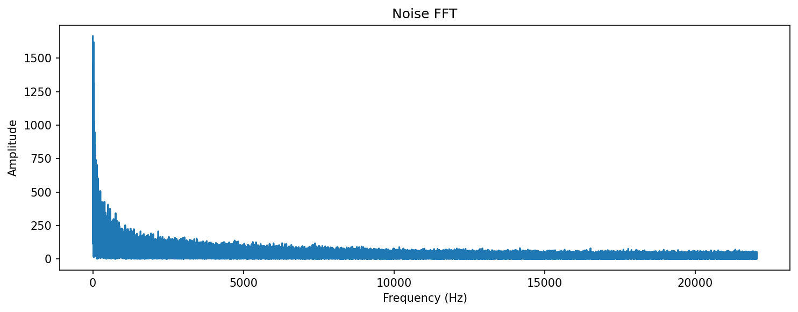
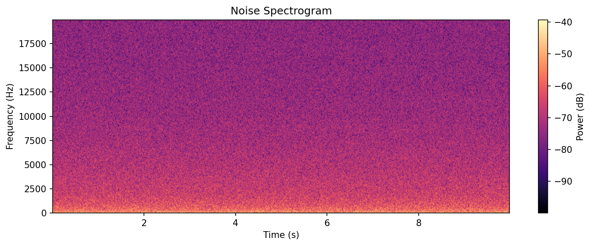

### Шум после фильтрации
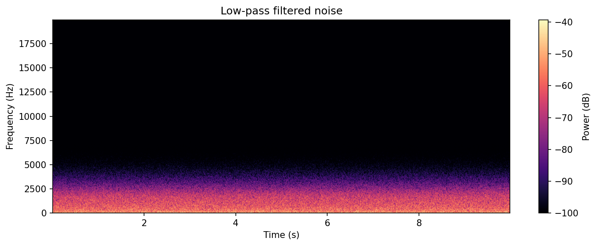
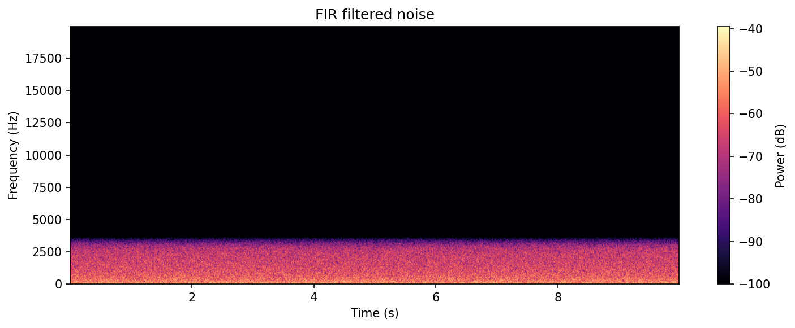

## 2. Анализ исходных аудиофрагментов

### Монолог
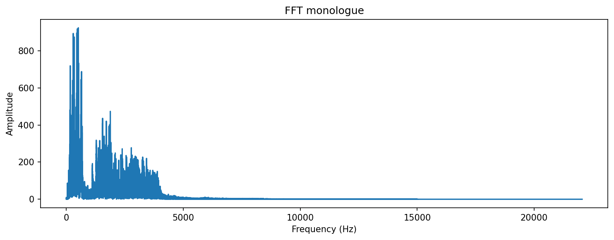
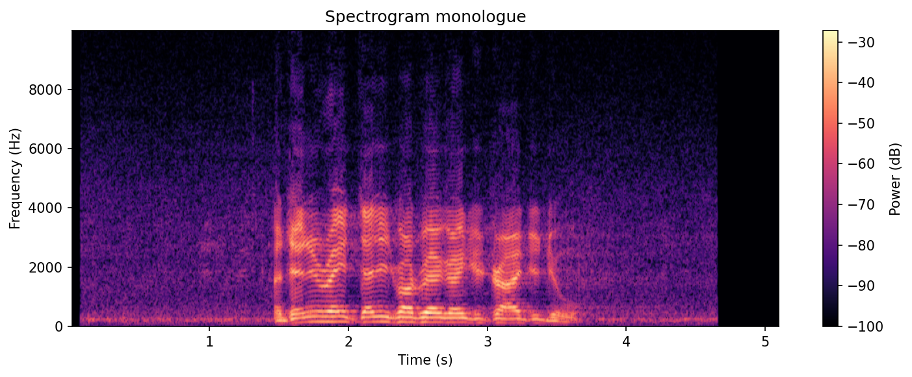

### Музыка
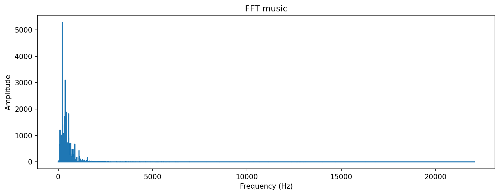

### Сэмпл
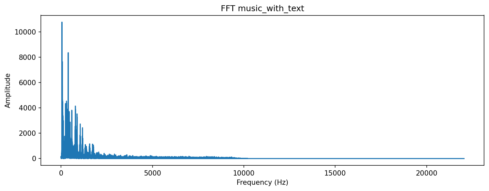
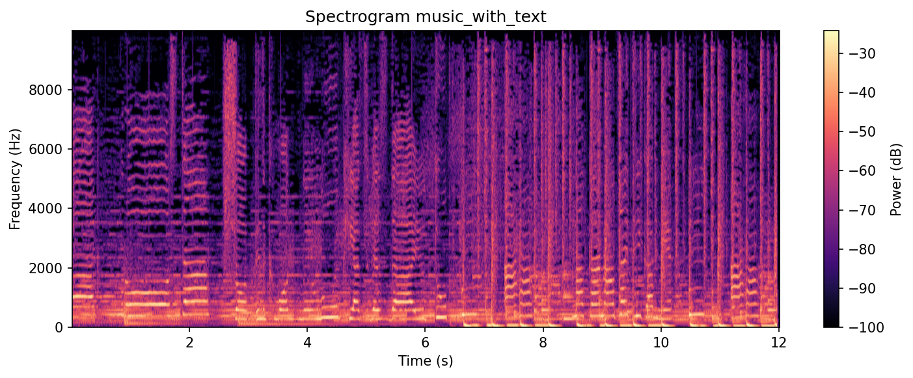

## 3. Фильтр 2 — фильтр нижних частот (ФНЧ)

### Монолог
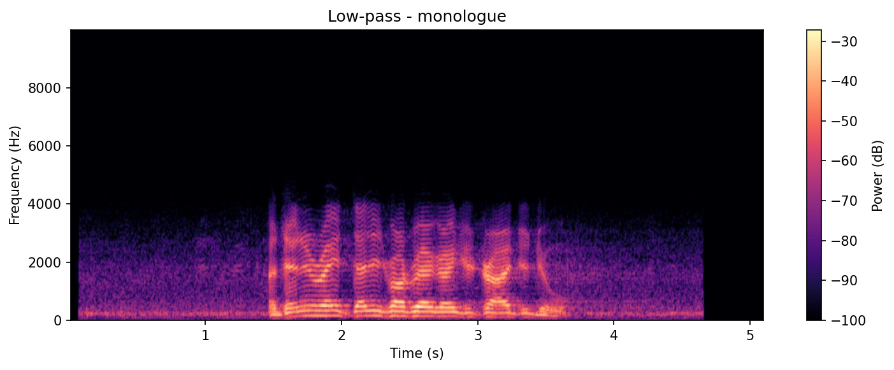

### Музыка
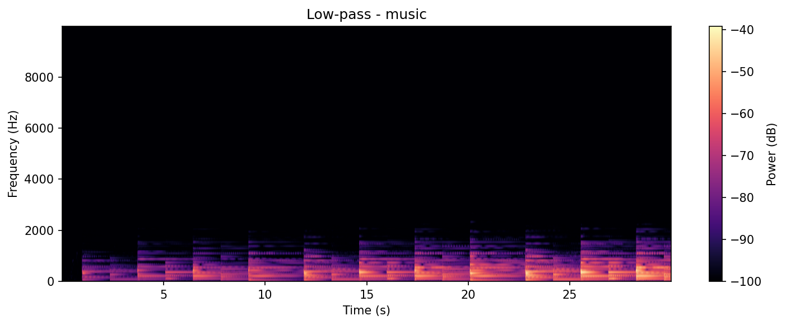

### Сэмпл
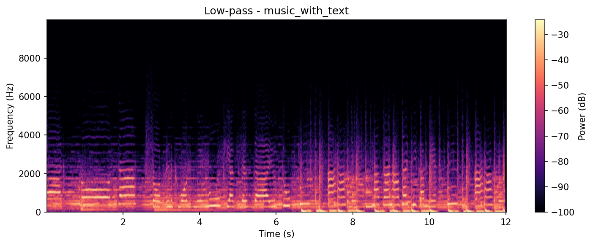

## 4. Фильтр 10 — КИХ-фильтр

### Монолог
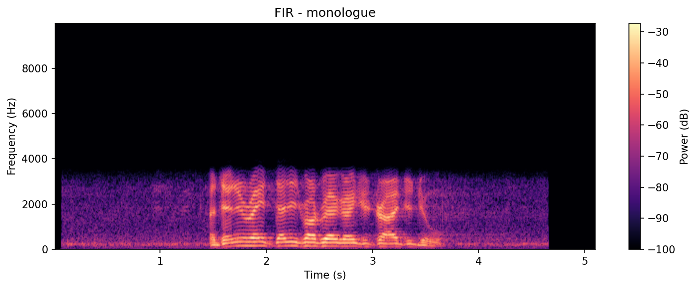

### Музыка

### Сэмпл

## 5. Последовательная фильтрация (ФНЧ -> КИХ)

### Монолог
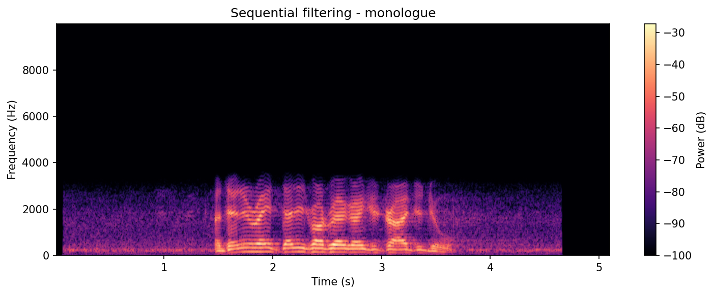

### Музыка

### Сэмпл
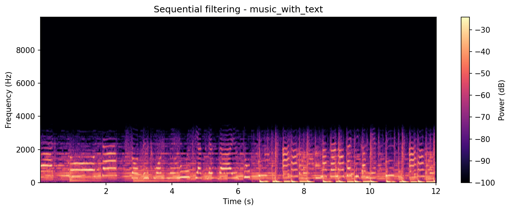